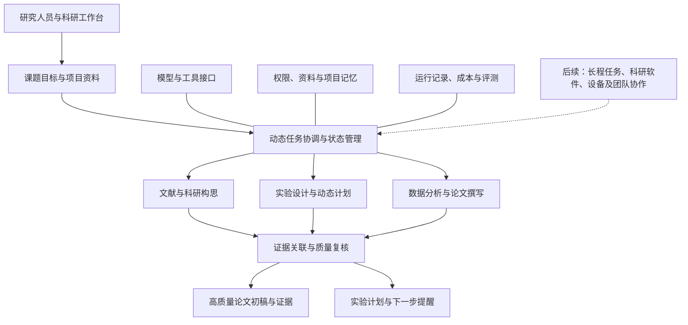

# 研枢科研智能体平台 总体架构图

本图为规划设计，展示首期两项并列业务目标与支撑能力，后续模块为阶段性扩展。

```mermaid
flowchart TB
 U[研究人员与科研工作台] --> P[课题目标与项目资料]
 P --> O[动态任务协调与状态管理]
 O --> L[文献与科研构思]
 O --> X[实验设计与动态计划]
 O --> W[数据分析与论文撰写]
 L --> Q[证据关联与质量复核]
 X --> Q
 W --> Q
 Q --> D[高质量论文初稿与证据]
 Q --> E[实验计划与下一步提醒]
 T[模型与工具接口] --- O
 S[权限、资料与项目记忆] --- O
 V[运行记录、成本与评测] --- O
 F[后续：长程任务、科研软件、设备及团队协作] -.-> O
```

论文路线和实验规划路线共享文献、数据、权限与复核底座，二者可在同一项目内衔接。计划提醒由时间或前置任务触发，研究者反馈后可调整后续任务与时间。
